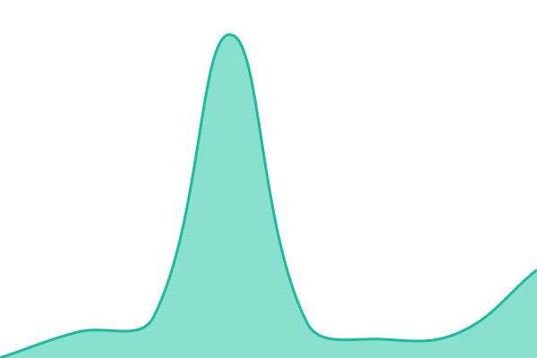

# [📈 Live Status](https://uptime.linkos.org): <!--live status--> **🟩 All systems operational**

This repository contains the open-source uptime monitor and status page for [LinkOS](https://linkos.io), powered by [Upptime](https://github.com/upptime/upptime).

With [Upptime](https://upptime.js.org), you can get your own unlimited and free uptime monitor and status page, powered entirely by a GitHub repository. We use [Issues](https://github.com/OpenLinkOS/uptime/issues) as incident reports, [Actions](https://github.com/OpenLinkOS/uptime/actions) as uptime monitors, and [Pages](https://uptime.linkos.org) for the status page.

<!--start: status pages-->
<!-- This summary is generated by Upptime (https://github.com/upptime/upptime) -->
<!-- Do not edit this manually, your changes will be overwritten -->
<!-- prettier-ignore -->
| URL | Status | History | Response Time | Uptime |
| --- | ------ | ------- | ------------- | ------ |
|  [LinkOS Docker Registry Mirror](https://docker.linkos.org) | 🟩 Up | [link-os-docker-registry-mirror.yml](https://github.com/openlinkos/uptime/commits/HEAD/history/link-os-docker-registry-mirror.yml) | 

 634ms
     
 | 

<a href="https://uptime.linkos.org/history/link-os-docker-registry-mirror">100.00%</a>
    

|  [LinkOS GCR Registry Mirror](https://gcr.linkos.org) | 🟩 Up | [link-os-gcr-registry-mirror.yml](https://github.com/openlinkos/uptime/commits/HEAD/history/link-os-gcr-registry-mirror.yml) | 

 1295ms
     
 | 

<a href="https://uptime.linkos.org/history/link-os-gcr-registry-mirror">100.00%</a>
    

|  [LinkOS GHCR Registry Mirror](https://ghcr.linkos.org) | 🟩 Up | [link-os-ghcr-registry-mirror.yml](https://github.com/openlinkos/uptime/commits/HEAD/history/link-os-ghcr-registry-mirror.yml) | 

 347ms
     
 | 

<a href="https://uptime.linkos.org/history/link-os-ghcr-registry-mirror">100.00%</a>
    

|  [LinkOS K8S Registry Mirror](https://k8s.linkos.org) | 🟩 Up | [link-os-k8-s-registry-mirror.yml](https://github.com/openlinkos/uptime/commits/HEAD/history/link-os-k8-s-registry-mirror.yml) | 

 371ms
     
 | 

<a href="https://uptime.linkos.org/history/link-os-k8-s-registry-mirror">100.00%</a>
    

|  [LinkOS Quay Registry Mirror](https://quay.linkos.org) | 🟩 Up | [link-os-quay-registry-mirror.yml](https://github.com/openlinkos/uptime/commits/HEAD/history/link-os-quay-registry-mirror.yml) | 

 408ms
     
 | 

<a href="https://uptime.linkos.org/history/link-os-quay-registry-mirror">100.00%</a>
    

<!--end: status pages-->

[**Visit our status website →**](https://uptime.linkos.org)

## 📄 License

- Powered by: [Upptime](https://github.com/upptime/upptime)
- Code: [MIT](./LICENSE) © [LinkOS](https://linkos.io)
- Data in the `./history` directory: [Open Database License](https://opendatacommons.org/licenses/odbl/1-0/)
